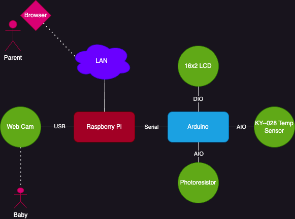

# baby_monitor

## Setup
Hardware




Software


1. ```virtualenv venv --system-site-packages```
1. ```. venv/bin/activate```
1. ```pip install -r requirements.txt```
1. Obtain yolo weights from [here](https://pjreddie.com/darknet/yolo/)

## Run
1. ```python baby_monitor.py```

## Patrol baby!
1. Open browser on ip_addr:5000 and watch baby :-P
